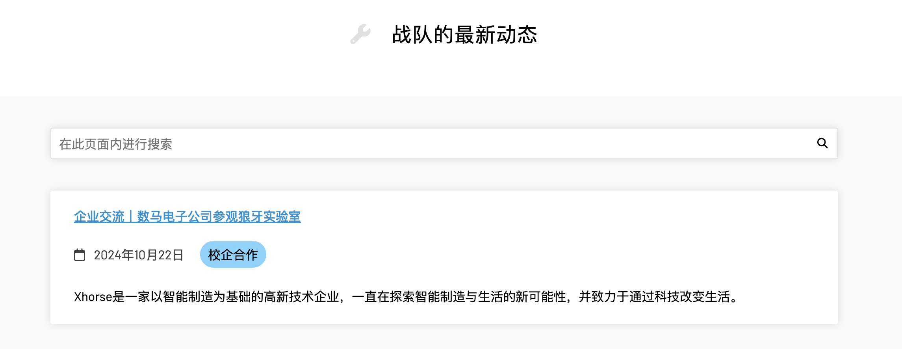

# 华中科技大学狼牙战队官方网站

## 演示
请访问 **[www.hustlangya.fun](https://www.hustlangya.fun)** 🚀

_本项目基于 [Lab Website Template](https://greene-lab.gitbook.io/lab-website-template-docs) 构建_

## 项目简介

本项目是华中科技大学狼牙战队官方网站，用于展示狼牙战队的相关信息，包括队伍成员、项目介绍、比赛成绩、团队成果等。

本项目亦可作为其他队伍的官方网站模板，只需简单修改配置文件即可。不需要任何编程知识，低代码即可完成网站搭建。

## 核心功能
### 团队获奖展示 🏆
支持展示团队获奖情况，包括奖项名称、奖项级别、获奖日期、获奖成员、项目描述等。

### 团队项目展示 🚀
支持展示团队项目情况，包括项目名称、项目描述、项目成员、项目图片等。

### 团队成员展示 👨‍👩‍👧‍👦
支持展示团队成员情况，包括成员姓名、成员职位、成员简介、成员照片等。

成员个人卡片

成员详情

团队成员支持分级展示，如队长、副队长、技术负责人、普通队员等。

团队成员支持与团队成果的关联，如团队成员获奖情况、团队成员参与的项目等。

### 博客文章 📝
支持发表博客文章，用于展示团队成员的技术分享、团队活动、团队成果等。

博文支持关联团队成员、团队项目、团队获奖等。

### 新闻文章 📰
支持发表新闻文章，用于展示团队的新闻动态、团队成果等。

## 使用方法

视频使用教程已发布到 [Bilibili 【一键创建你的战队官网！零代码零成本！】 ](https://www.bilibili.com/video/BV1M79HYJEeu/)。

### 创建网站
1. 点击项目右上角的 `Use this template` 按钮，创建一个新的仓库。

2. 进入 `Actions` 页面，执行 `first-time-setup` workflow，初始化网站。

3. 修改 `_config.yml` 文件，配置网站基本信息。请确保至少设置了title、description字段。

4. 设置Github Pages，选择 `gh-pages` 分支作为网站源。

5. 等待几分钟，您的网站就会自动部署到GitHub Pages上了。

### 预览网站
#### GitHub Pages（推荐）

当您在GitHub上打开或更新Pull Request（PR）请求时，GitHub Actions会将更改进行实时预览。预览链接将会自动更新在PR请求的评论中。这样，审阅者和编辑可以方便地看到每次更改的切实结果。

#### 本地预览
1. 安装 Docker Desktop（推荐）或 Docker，并启动 Docker。
2. 将您所创建的项目克隆到本地。
3. 在您项目的本地路径下执行 `./.docker/run.sh`
4. 等待Docker安装所有的依赖。第一次花费约2分钟。
5. 在浏览器中打开 `http://localhost:4000` 即可预览网站。
6. 当您更改项目文件时，预览网站会实时刷新/更新，仅有在更改_config.yaml的后需要您手动刷新。

_注意：您可能需要为Docker配置特殊的网络环境以支持Docker安装所需要的依赖。_

### 网站信息配置
#### 配置文件
以`_`开头的文件夹为配置文件夹，用于配置团队的相关信息。
| 配置文件夹 | 说明 |
| --- | --- |
| `_config.yml` | 网站的基本信息配置，包括网站名称、网站描述、网站图标、网站主题等 |
| `_members` | 团队成员信息配置 |
| `_awards` | 团队获奖信息配置 |
| `_projects` | 团队项目信息配置 |
| `_patents` | 团队所获专利信息配置 |
| `_posts` | 博客文章信息配置 |
| `_news` | 新闻文章信息配置 |

### 更多配置
请参考 [Lab Website Template](https://greene-lab.gitbook.io/lab-website-template-docs) 文档。

## 贡献
欢迎提交PR，一起完善本项目，欢迎在Issues中提出您的建议和需求。

如果您觉得本项目对您有所帮助，欢迎Star⭐️本项目！